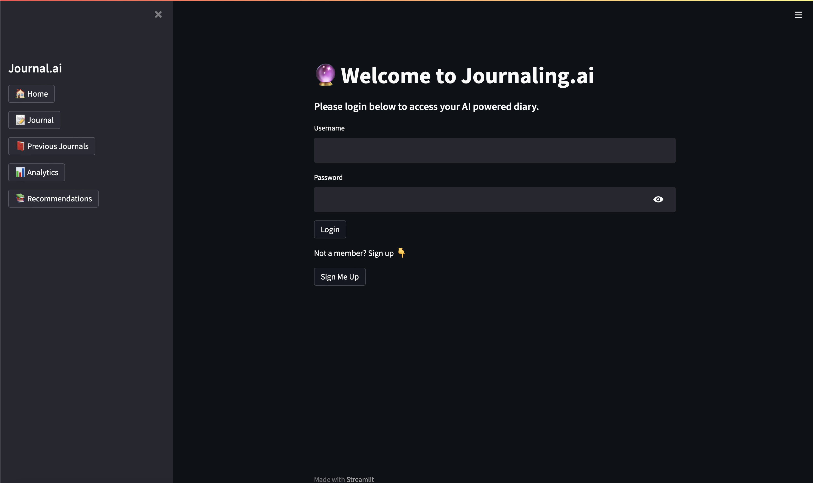

# Journal.ai is the new way of AI Journaling

## Description
Journal.ai is an AI-powered journaling tool designed to help you understand your emotions and improve your well-being. Using advanced natural language processing (NLP) to analyze your entries, it offers insightful recommendations tailored to your emotional state. Additionally, it includes a suicide prevention algorithm to support you in making healthier decisions for your mental health.  

## How to run the project

RUN pip3 install -r requirements.txt

CMD streamlit run --server.port 8080 --server.enableCORS false app.py

